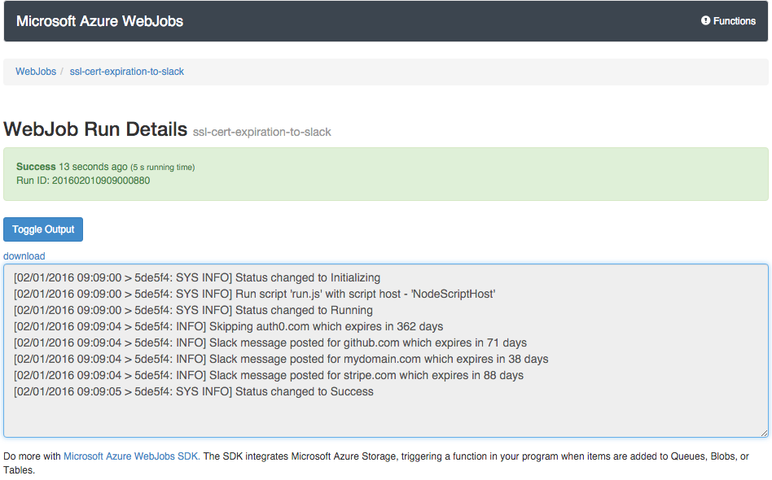

# SSL Certificate Expiration to Slack

Verify the status of SSL certificate for one of more domains and post this to Slack. This is useful to monitor your own certificates but also certificates of external services you use.

## Settings

 - `DOMAINS`: A list of domains you want to monitorg (eg: `github.com;twitter.com;facebook.com`)
 - `DAYS_THRESHOLD`: If the certificate is valid for more than DAYS_THRESHOLD, nothing will be posted to Slack.
 - `SLACK_INCOMING_WEBHOOK_URL`: URL of your incoming webhook

## Deployment

### Azure

[](https://portal.azure.com/#create/Microsoft.Template/uri/https%3A%2F%2Fraw.githubusercontent.com%2Fsandrinodimattia%2Fssl-cert-expiration-to-slack%2Fmaster%2Fazuredeploy.json)

Clicking this button will let you create a new Azure Web App with a triggered web job that runs once per day (you can modify the CRON schedule in the `settings.job` file using the SCM site, changes are immediately applied).

This Resource Manager template will:

 1. Create the App Service Plan if it doesn't exist
 2. *Change* the App Service Plan to the SKU and WORKERSIZE you configure. So make sure you set values of your existing plan if you don't want any changes.
 3. Create a Web App with a Triggered Web Job



### Webtask

If you haven't configured Webtask on your machine run this first:

```
npm i -g wt-cli
wt init
```

> Requires at least node 0.10.40 - if you're running multiple version of node make sure to load the right version, e.g. "nvm use 0.10.40"

If you just want to run it once:

```
wt create https://raw.githubusercontent.com/sandrinodimattia/ssl-cert-expiration-to-slack/master/task.js \
    --name ssl-cert-expiration-to-slack \
    --secret DOMAINS="google.com;facebook.com;twitter.com" \
    --secret DAYS_THRESHOLD=90 \
    --secret SLACK_INCOMING_WEBHOOK_URL="https://hooks.slack.com/services/xxx"
```

If you want to run it on a schedule (run every day at 10 AM for example):

```
wt cron schedule \
    --name ssl-cert-expiration-to-slack \
    --secret DOMAINS="google.com;facebook.com;twitter.com" \
    --secret DAYS_THRESHOLD=90 \
    --secret SLACK_INCOMING_WEBHOOK_URL="https://hooks.slack.com/services/xxx"
    --json \
    "30 10 * * *" \
    https://raw.githubusercontent.com/sandrinodimattia/ssl-cert-expiration-to-slack/master/task.js
```

> If you decide you want to monitor more domains over time just rerun the command to replace your current job.

### Windows/Linux

This is a simple Node.js application, so you can schedule it as a cron job, a scheduled task in Windows, ...

 - Run Node.js 5+
 - Update the `config.json` file or set the required environment variables

Usage:

```
npm install
node index
```
